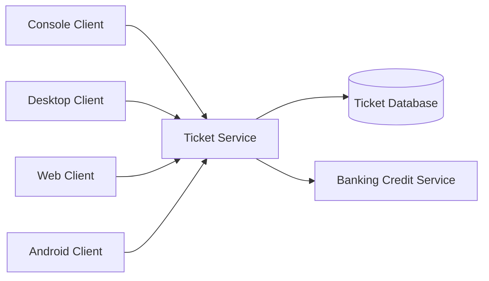

# TicketPremium Platform

TicketPremium is an academic platform for football match ticket sales. It includes a Java SOAP version and a .NET REST version.

## Overview

The system models matches, stadium areas, seats, purchases, invoices, users, and sales reports. It also connects ticket purchases with a banking credit service.

## Main Features

- User login
- Match and stadium area browsing
- Seat selection
- Ticket purchase and invoice records
- Sales reports
- Credit simulation and banking service calls

## Architecture

The repository contains two separate implementations:

- Java clients with SOAP federation and banking services
- .NET clients with a REST API



## Applications

| Application | Technology | Purpose |
| --- | --- | --- |
| Java services | Java and SOAP | Provide ticket and banking operations |
| Java clients | Console, Swing, JSP | Use the SOAP services |
| Mobile client | Kotlin / Android | Provide mobile ticket access |
| .NET REST server | C# and ASP.NET Web API | Provide REST operations |
| .NET clients | Console, desktop, and web | Use the REST API |

## Tech Stack

### Backend

- Java, Maven, and JAX-WS
- C# and ASP.NET Web API

### Clients

- Java Swing
- JSP and Servlets
- Kotlin and Android
- .NET console, desktop, and web applications

### Communication

- SOAP
- REST

### Database

- MySQL
- SQL Server

### Tools

- Maven
- Gradle
- Visual Studio solutions
- Python database setup utility

## Project Structure

```text
ticket-premium-platform/
├── java-soap/
└── dotnet-rest/
```

## Getting Started

Prepare the database with the included SQL or setup files. Define the environment variables listed in `.env.example`. Build Java modules from their `pom.xml` folders and open the Android app in Android Studio. Open .NET solutions in Visual Studio. Start the required backend services before their clients.

## Screenshots

Screenshots will be added soon.

## Academic Context

This group project was developed for a university software architecture course. It was used to practice SOAP, REST, databases, and applications for several platforms.
